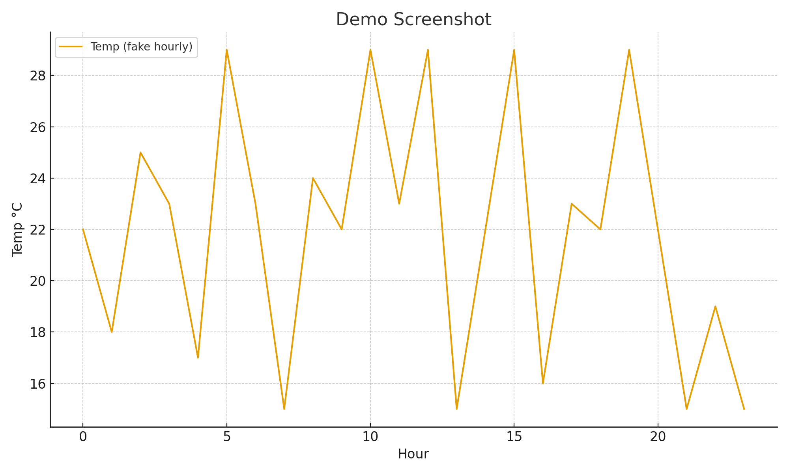

# 보고서: Korea Weather & Air Quality Reporter

## 1) 프로젝트 제목
Korea Weather & Air Quality Reporter

## 2) 프로젝트 개요
여러 도시를 지정해 **날씨(최저/최고/강수확률) + 미세먼지(PM2.5, PM10, AQI)** 를
매일 아침 자동으로 수집·요약하여 텔레그램으로 보내는 서비스입니다.
Open‑Meteo API(무 Key)를 사용해 과제 데모 장벽을 낮추고, GitHub Actions로
매일 오전 일정에 맞춰 실행되도록 구성했습니다.

## 3) 본인이 입력한 텍스트(프롬프트/명령)
- Cursor:
  - "Open‑Meteo로 여러 도시 날씨/공기질 받아와 요약하는 함수 만들어줘"
  - "도시명이면 지오코딩으로 lat/lon 구하고, 좌표면 그대로 쓰는 로직"
  - "텔레그램 메시지 전송 함수 notifier.py로 분리"
- Gemini CLI(예시):
  - `gemini think --prompt "한국 주요 도시 날씨/미세먼지 자동 리포트 설계"`
  - `gemini code --prompt "requests로 Open‑Meteo 호출해서 pm2_5, pm10, european_aqi와 daily forecast 묶기"`

## 4) 구현 상세
- Weather API: Open‑Meteo Forecast & Air Quality
- 지표: 일간 최저/최고, 강수확률, PM2.5/PM10, 유럽 AQI
- 알림: Telegram Bot API
- 스케줄: GitHub Actions (KST 07:30)

## 5) 스크린샷
실행 후 텔레그램 메시지 화면 캡처 이미지를 삽입하세요.

## 6) 카카오톡 확장 아이디어
- 카카오 채널 알림 API(정식 경로, 검수 필요)로 전환 가능
- 단기 데모는 텔레그램으로 검증 후 보고서에 설계/시퀀스 다이어그램 포함

## 7) 추가 확장
- 체감지수(체감온도, 자외선) 포함
- 경보 임계치 사용자화 및 도시별 임계 분리
- 슬랙/이메일 병행 알림
